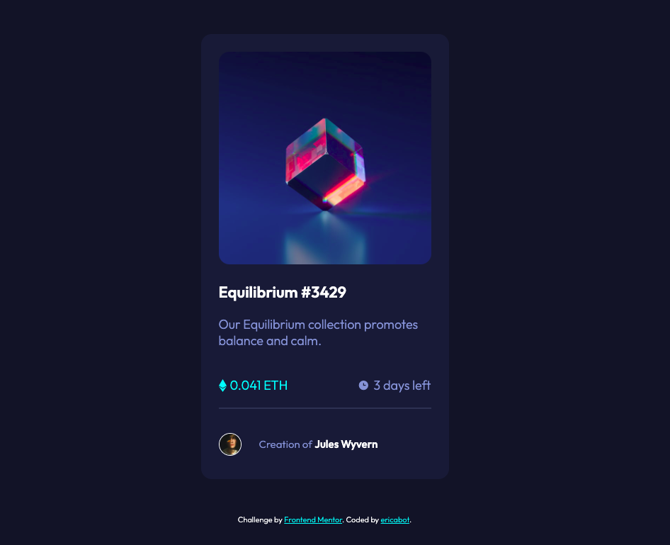

# Frontend Mentor - NFT preview card component solution

This is a solution to the [NFT preview card component challenge on Frontend Mentor](https://www.frontendmentor.io/challenges/nft-preview-card-component-SbdUL_w0U). Frontend Mentor challenges help you improve your coding skills by building realistic projects.

## Table of contents

- [Frontend Mentor - NFT preview card component solution](#frontend-mentor---nft-preview-card-component-solution)
  - [Table of contents](#table-of-contents)
  - [Overview](#overview)
    - [The challenge](#the-challenge)
    - [Screenshot](#screenshot)
    - [Links](#links)
  - [My process](#my-process)
    - [Built with](#built-with)
  - [Author](#author)
  - [Acknowledgments](#acknowledgments)
## Overview

### The challenge

Users should be able to:

- View the optimal layout depending on their device's screen size
- See hover states for interactive elements

### Screenshot

### Links

- Solution URL: [click here](https://github.com/EricaSugui/frontendmentor_nft_preview_card_component)
- Live Site URL: [click here](https://ericasugui.github.io/frontendmentor_nft_preview_card_component/)

## My process

### Built with

- Semantic HTML5 markup
- CSS custom properties
- Flexbox
- Node-Sass (scss)
- Nodemon
- Mobile-first workflow

## Author

- Website - [Erica Daikawa](https://www.your-site.com)
- Frontend Mentor - [@EricaSugui](https://www.frontendmentor.io/profile/ericasugui)
- Twitter - [@ericaakira](https://www.twitter.com/ericaakira)

## Acknowledgments

This is where you can give a hat tip to anyone who helped you out on this project. Perhaps you worked in a team or got some inspiration from someone else's solution. This is the perfect place to give them some credit.
